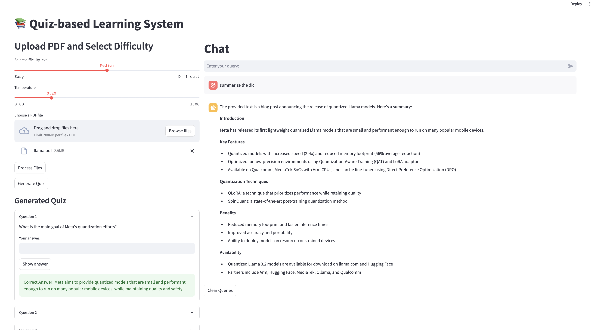

# quiz-based-learning-using-multimodal-rag
This project aims to improve the learning of a material by creating a quiz and a question-answer platform using LLMs and Vector databases. 

There is proven research that has shown that taking quiz/test on a material significantly decreases the forgetting of the material learned. Interestingly, irrespective of the performance on the test/quiz, it has been seen to improve the recall of a learned material. 

Hence, I have created this demo application, that utilizes LLMs and RAG that automatically create a quiz and a query platform for a user to learn about the material. Currently, this suports PDF but this will soon be able to process data from Images/Charts if i use multimodeal LLMs. 

LLM -  llama3.2:1b    
Vector database - Weaviate DB    
UI - Streamlit   

